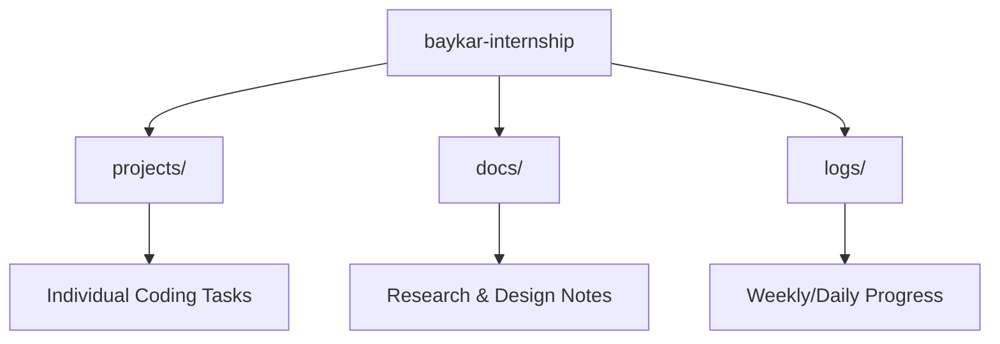

# ✈️ Baykar Internship Portfolio

Welcome to my official internship repository for **Baykar**. This repository serves as a centralized hub for all my projects, research, and learning progress during my tenure at the company.

## 🚀 Overview

- **Department:** Technical Documentation
- **Duration:** Summer 2026
- **Mentor:** Berkay xxx

> [!NOTE]
> This repository contains academic and professional work related to my internship at Baykar. All proprietary information has been excluded to respect confidentiality agreements.

---

## 📂 Repository Structure

- **`projects/`**: Source code and implementation details for assigned tasks.
- **`docs/`**: Technical documentation, architecture designs, and research notes.
- **`logs/`**: A chronological record of my internship journey.

---

## 🎯 Goals & Objectives

- [ ] Complete onboarding and environment setup.
- [ ] Contribute to the [Specific Project Name] development.
- [ ] Master core technologies like [Tech 1], [Tech 2], and [Tech 3].
- [ ] Document key learnings in the `logs/` directory.

---

## 🛠️ Tech Stack & Tools

---

## 📅 Internship Log

| Week | Focus Area | Status |
| :--- | :--- | :--- |
| **Week 1** | [Onboarding & Setup](logs/week-01.md) | 🟢 In Progress |
| **Week 2** | [Future Task] | ⚪ Pending |
| **Week 3** | [Future Task] | ⚪ Pending |

---

## 📄 License

This project is licensed under the [MIT License](LICENSE) - see the file for details.
*(Note: Ensure this complies with company policy before publicizing.)*
